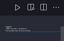

Installation:
```shell
  python -m pip install -r requirements.txt
```
To run the project, select the file and click play at the right upper corner: </br>



___
For more information:
</br>
</br>
<a href='https://pandas.pydata.org/docs/index.html'>Pandas Documentation</a>
</br>
<a href='https://matplotlib.org/'>MatPlot Library</a>
</br>
<a href='https://devguide.python.org/'>Python for Devs</a>
</br>
<a href='https://www.djangoproject.com/'>Django</a>
</br>
